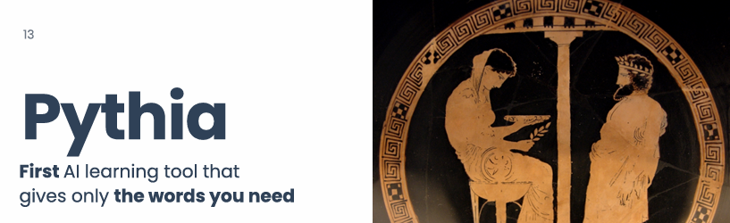
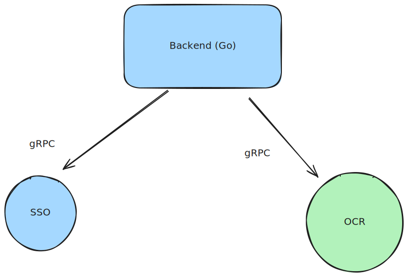
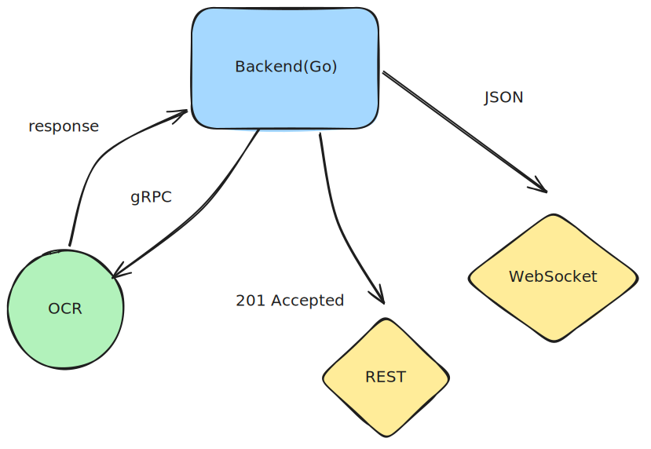

## About

	Have you faced with new words overload, when you tried learn foreign language?  Pythia is to help!

Pythia is a web-application that provides steady and consistent foreign language study flow. You no longer have to waste time finding, translating, and learning new words from your study materials!

- Automatic unknown-words selection
- Automatic study-session summarizer: gives only 10-15 most valuable words from learning session
- Automatic flashcards and Quizlet-like tests


## Quick start

1. Do git clone
```
git clone github.com/rwrrioe/pythia
```

2. Install [Installation | Task](https://taskfile.dev/docs/installation)

3. Set env (more)

```
backend:

cd backend/cmd/app
touch .env
ENV (dev)
GEMINI_API_KEY=
LOGGER_ENV=local
APP_SECRET=

frontend:

cd ./frontend
touch .env

ENV (dev)
VITE_API_BASE=http://localhost:8080/api  
VITE_API_ORIGIN=http://localhost:8080  
VITE_WS_PATH=/ws

```


4. Build containers
```
task front //frontend
task dev-up //backend
```

---
## Architecture

### Services

Pythia is mainly written in Golang. There is main backend service, sso-service (auth/authn), OCR-python service.




### WebSocket & REST

Executing heavy operations (LLM translations, OCR) can take some time. Then, we firstly return 201 Accepted to REST. All fallbacks and final response are sent through WebSocket.



For further development, it's planned to migrate to microservice architecture. More on
documentation docs/API and Core 


