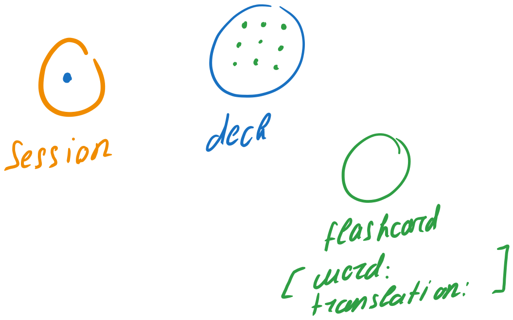
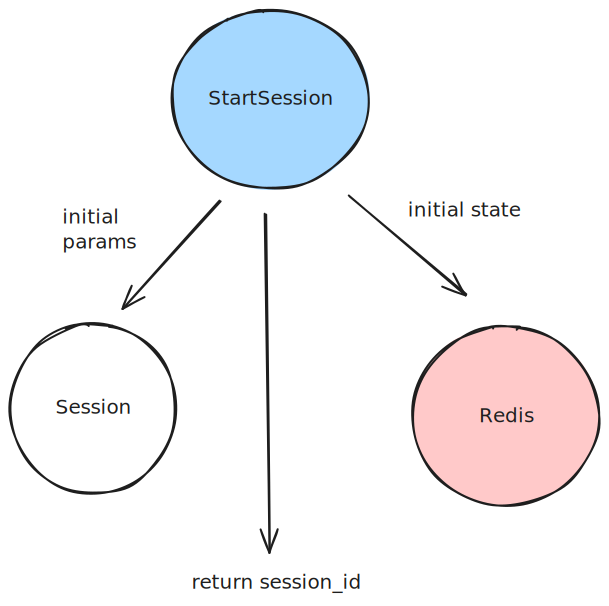
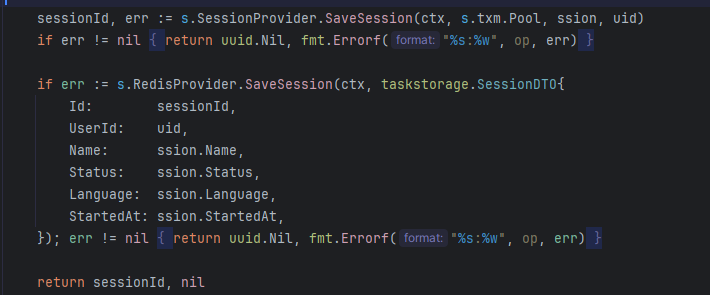
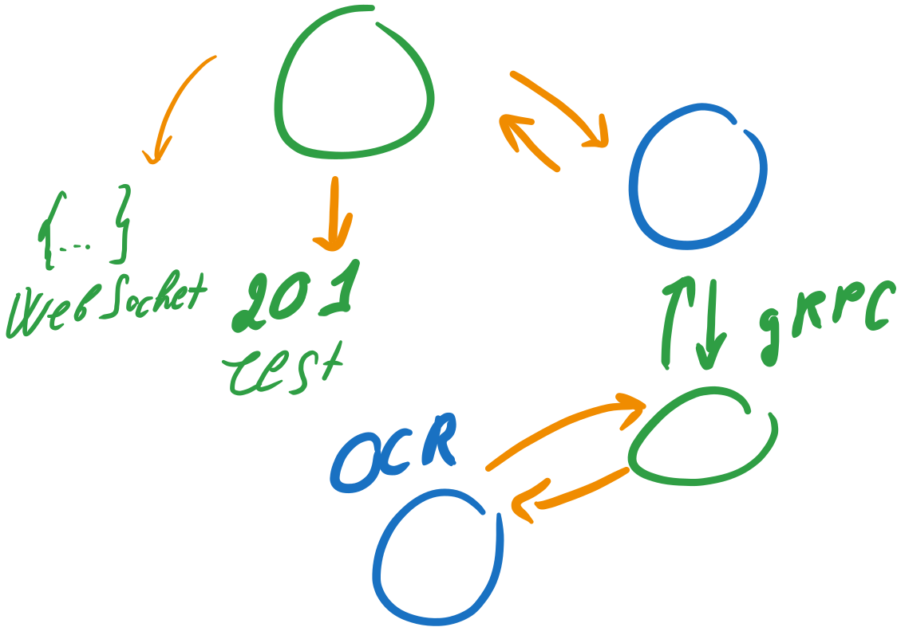
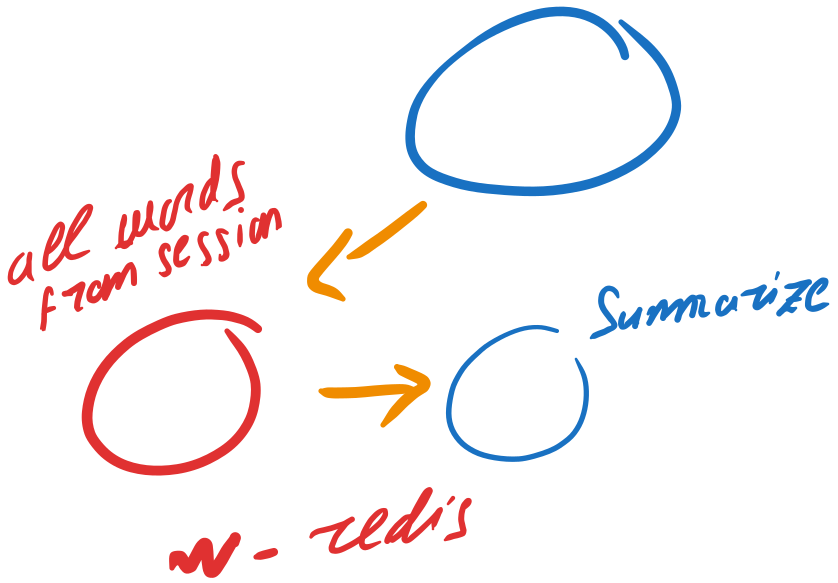
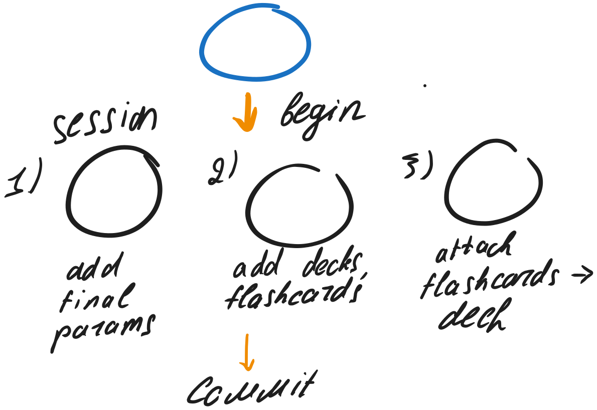
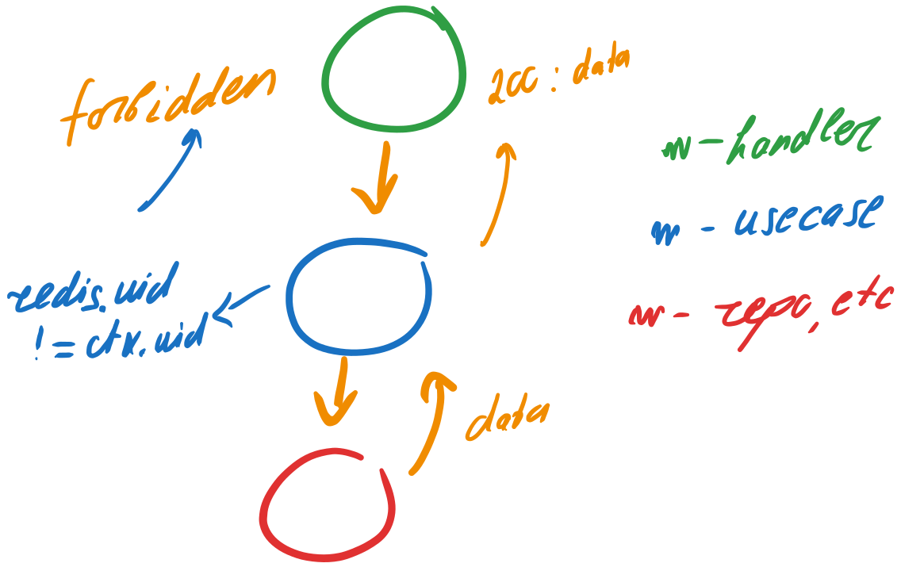
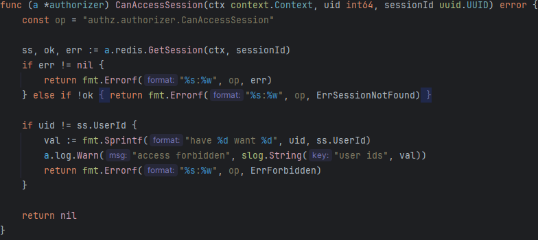

## Core 

### Terminology

**In context of inner structure**

- Green is always handler / transport layer (REST, WebSocket)
- Blue is always usecase. Usecase may call other functions, for example authorizers, which is not displayed explicitly for simplicity, but always mentioned.
- Red/Black is always storage. We mean repositories or wrappers under that definition since db-connection wrapper play no role in the flows below.

**Database structure**

	the only exception for the color rule above :)

**Core concepts**:
- One learning session contains only one deck
- Deck may contain one or more flashcards
- One flashcard consists of word and translation (and ofc primary key, since translations may differ for one word). 

___
## Starting session flow

Note that we should keep Postgres as the only source of truth. That's why we firstly save our session structure with its initial params in Redis **only after** we've saved it in the database.

  

### Call heavy functions (OCR / Translate) flow

 

Basically, handler returns 201 Accepted status to REST. In the second goroutine it calls usecase, which calls, for example, python OCR-service through gRPC. When the OCR is done, it returns the response through gRPC back to our usecase. Then, handler returns the final response through WebSocket.

### End session flow 

Firstly, we should find the most valuable words for our learning session. In this case, the handler is omitted because we want to focus on the usecase. 

Note that Summarize is a "heavy function". More on "heavy functions" can be found above. 

Secondly, we should correctly save all final data to the db and redis. We use transaction to save everything correctly. 

 

But what if the user did two requests in the one moment? We should deduplicate our data, as well as take into account GetOrCreate methods. 
	to be added

---
## APIs

### REST

to be added soon
### gRPC

to be added soon

---

## Authz & Authn breefly

### Authn pipeline

Authn pipeline is a simple token-based authentication. More [here](github.com/rwrrioe/sso) 
### Authz pipeline

Usecase calls authorizer, which compares uids from redis and from c.Request. If they are not matching it returns authz.ErrForbidden error.

 

### To be added

