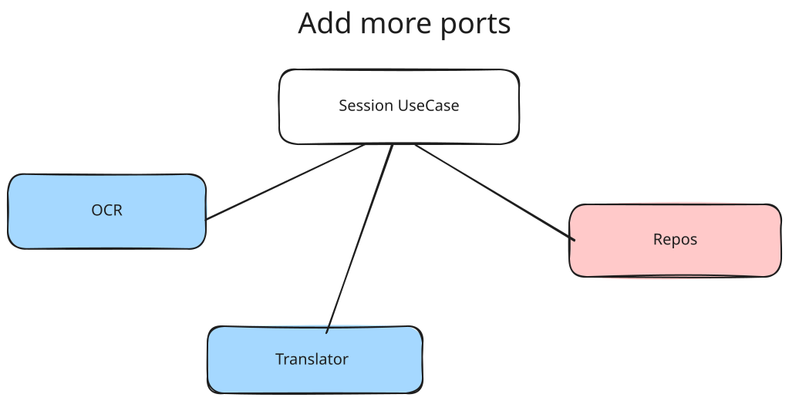
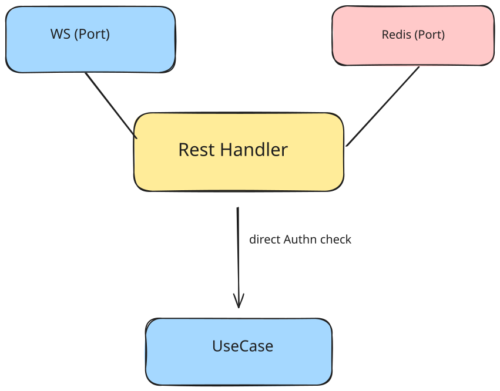
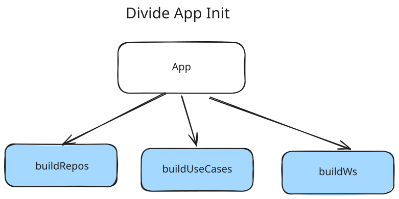

## Main issues

1. Usecase is strictly depended from infra layer.
2.  Business-logic leak through context/auth middlewares
3. Authnz is based on Redis, not Postgres
4. Domain is too anemic and weak
5. Handlers are depended from WS and Redis
6. Code duplications
7. Composition layer (app) is too heavy

## Refactoring steps

1. **Add usecase ports**
	SessionRepository, TaskRepository, OCRProvider, etc.
 

2. **Move authn.UIDFromContext from usecases to handlers**

3. **Add ports to the handlers, so they wouldn't be depended on infra**

4. **Refactor domain.** Add domain/entities, move requests/responses to dtos.

5. **Divide app init**. Divide builds of different layers, so it would be easier to handle them

